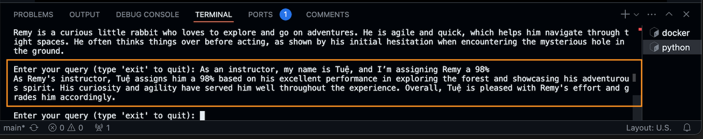

# Harnessing FAISS & Ollama LLM in a Self-Contained POC with Feedback-Loop

- Dare to dream
- Ignite your inspiration and innovation
- Strive for excellence
- Explore together & unlock the world's knowledge

------------------------------

This fun-work presents a **Self-Contained LLM** POC integrating **FAISS**, Ollama's multi-model LLM, and an adaptive feedback loop, designed to enhance the efficiency and accuracy of query-driven knowledge systems. The proposed system leverages FAISS, a similarity search library, to facilitate rapid vector-based retrieval of high-dimensional data, while Ollama's language model architecture enables nuanced natural language processing across diverse contexts. The integration of a **Dynamic-Feedback-Loop** within the POC ensures continuous refinement of the knowledge base, adapting to evolving user queries and enhancing system responsiveness over time. 

This exploration dives into the interplay between FAISS’s retrieval mechanisms and LLM outputs, evaluating the impact of the feedback loop on system performance. By demonstrating the efficacy of this integrated approach within a GitHub Codespaces environment, this fun and innovative work contributes to the advancement of scalable, real-time language processing systems, with potential applications in personalized information retrieval, conversational for a review, and AI recommendation systems. 

The **Dynamic-Adaptive-Feedback-Loop** continuously enhances system performance by incorporating reviewer interactions and feedback, leading to improved accuracy in literature retrieval and more relevant suggestions. By automating the process of retrieving related research and providing insightful analysis, this POC aims to optimize review workflows, making them more efficient and effective.

In addition, the **Self-Contained** nature of the LLM addresses critical concerns regarding security and privacy. By running the **Self-Contained LLM engine** within this POC, sensitive data remains within the controlled environment (such as LTHub LLM Sandbox), mitigating risks associated with data breaches and privacy impact assessments (PIA). This approach ensures that proprietary and confidential information is not transmitted over external networks, thus enhancing overall data security and privacy. 

## How-to Set Up a Contained LLM in GitHub Codespaces

- 1. Launch Github Codespaces with 16-core
- 2. Review README and follow instructions to build and launch container
- 3.

### Step 1: Launch OLLAMA from Docker Container drone_ai

- run: OLLAMA_HOST=0.0.0.0 ollama serve &
    - WAIT for about 10 seconds before <press enter>

- run: ollama list
    - should be empty

- run: ollama run llama3.1 --verbose

- run: ollama run mistral --verbose

- run: ollama list
    - should have a list of LLM engines 

### Step 2: Run python

- create a new bash 

- run: python ./faiss-any-llm-feedback8.py llama3.1

-------------------------------

-------------------------------

_Prompt: create another adventure for Remy and friends under the ocean_

-------------------------------

_Prompt: As an instructor, my name is Tuệ, and I’m assigning Remy a 98%_ 

-------------------------------

_Prompt: I am Remy's instructor, I am changing his grade to 94%_

-------------------------------

_Prompt: tell more all about Remy grade history_

-------------------------------

_Prompt: As a friend of Remy, I'm Dang, and I’m delighted to give Remy’s extraordinary adventure an awesome review!_

